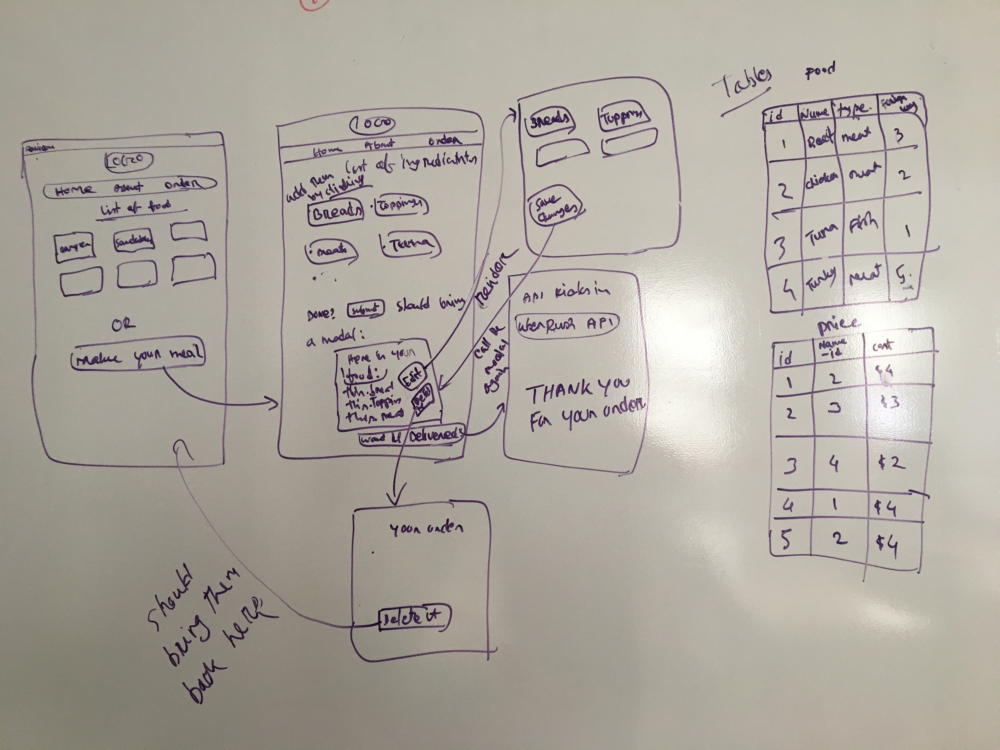

# KumraKake -- an app built with Express.js.
==============================================

***
## User Stories:
* Users should be able to land on a landing page which I call Homepage.
* Users should expect to see a welcome message and a button to go to next page.
* Users should see a list of items of food on the screen.
* Users should see the price of the food and be able to choose option to have the food delivered.

***
## What is it?
* An app to order food.
* It will render a list of food items.
* The food can be delivered provided that I figured out the API.

***
## Layout (Landing page)
* A landing page with a welcome message.

***
## Layout (index page)
* A list of food. 
* A button to order the food.

## Technologies Used:
* HTML
* CSS
* Express.js
* Node.js

## I will work on: Post MVP:
* making the app interactive using javascript
* integrating an API to add the delivery option to the app.
* having more of styling for the app.
* adding user authentication 

## If you want to check out the app:

[KumraKake](https://protected-reef-53266.herokuapp.com/)

